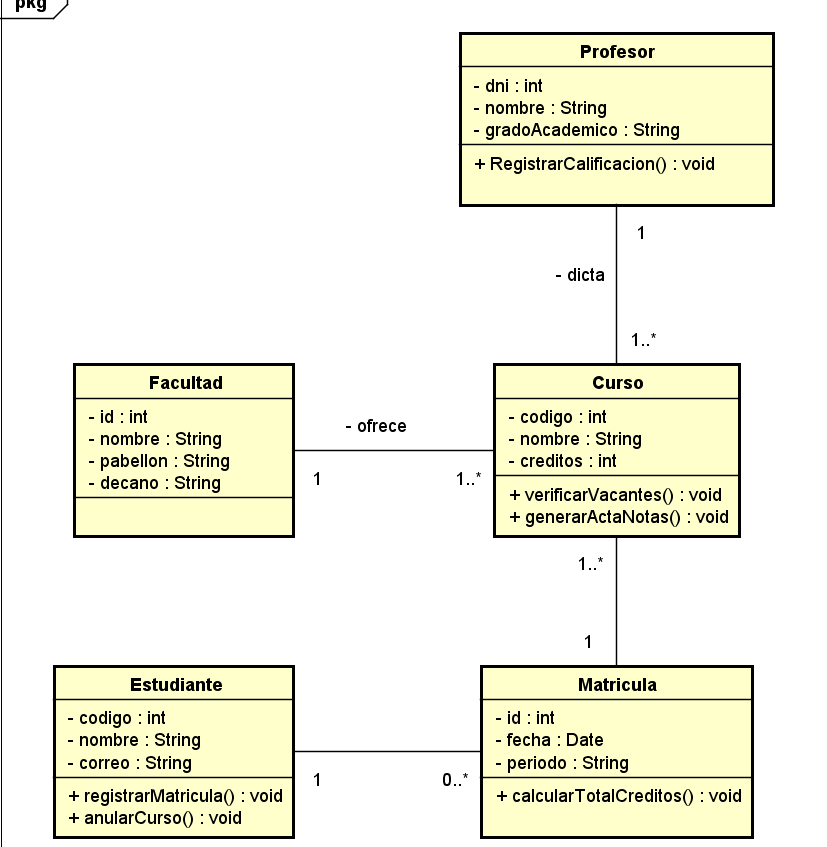
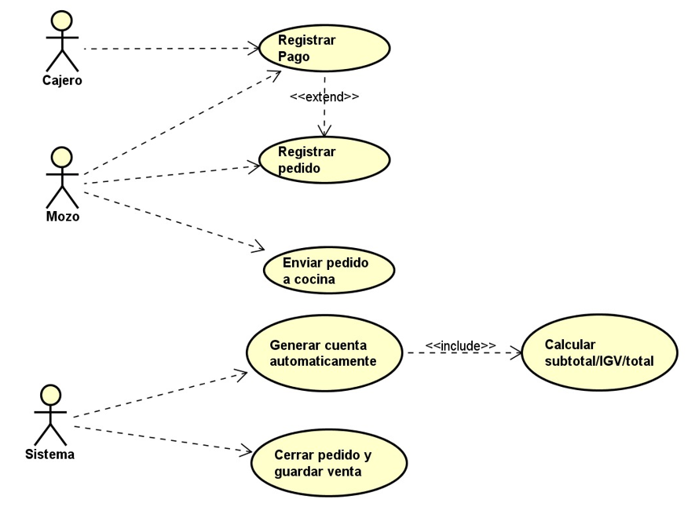
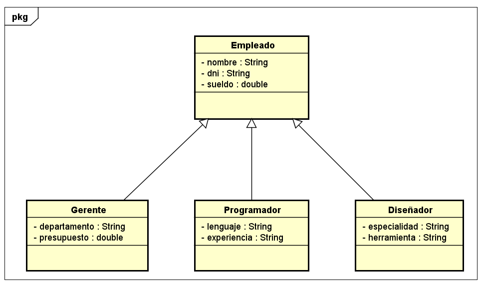
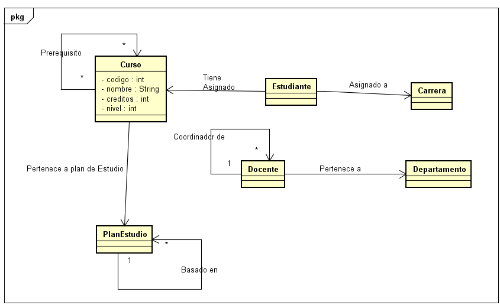
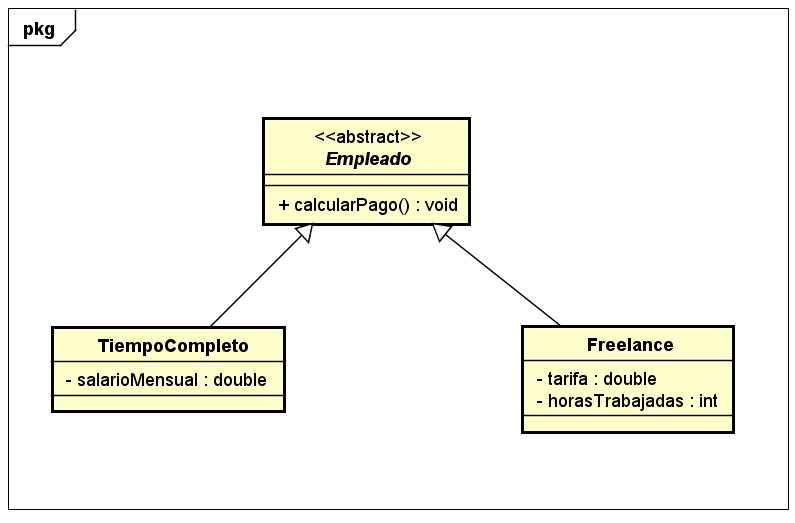
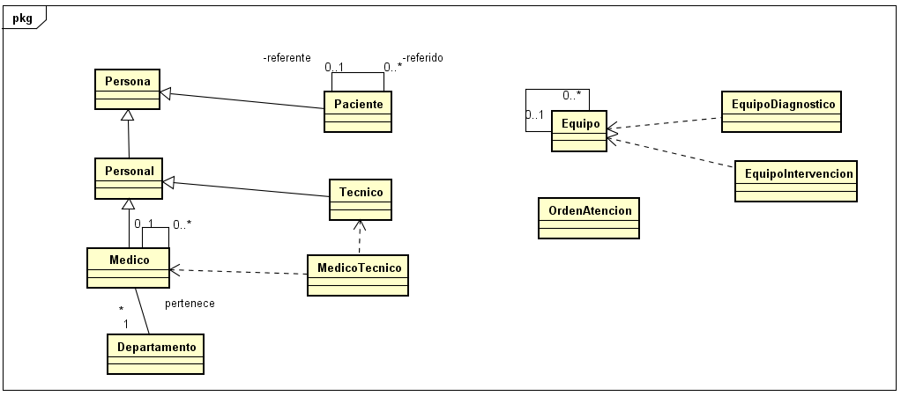
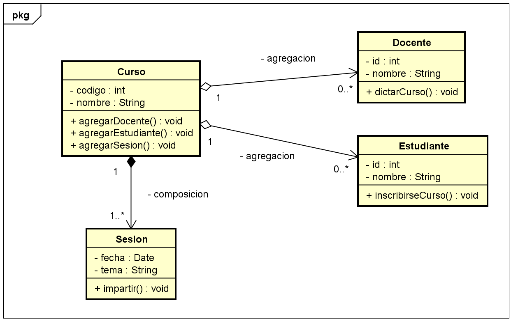
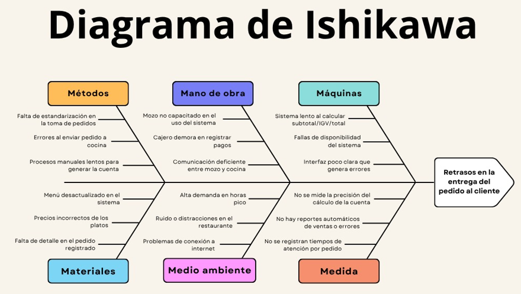
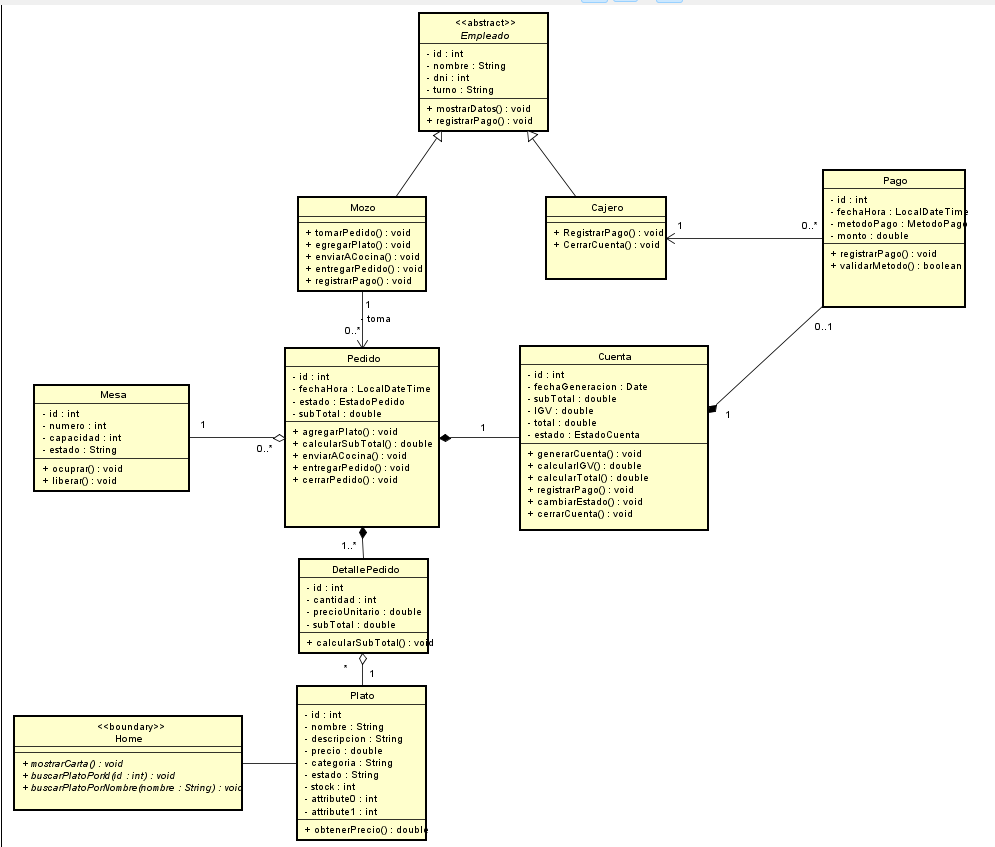

**GRUPO 01 Integrantes:**
1. Luzdany Fiorela Cabanillas Pizarro  
2. Victor Josue Castro Bayeto  
3. Sergio Gustavo Mori Ahuanari  
4. Lenin Anderson Mendo Cotrina
---
## Entregables T1
Este repositorio es unconsolidado para la T1 del curso *Técnicas de programación orientada a objetos*

### 🧰 Herramientas usadas

  

### Prácticas de campo de semana 1 - 5
Las prácticas de campo de la semana 1 a 5 se desarrollaron usando comandos de git desarrollando Proyectos como "Sistema Estudiante" y "Proceso de un Restaurante", dichos comandos se evidencia en el doc adjuntado en la entrega.  
 
    Puede encontrar los proyectos en estas carpetas:

    - PracticaCampSemana1
    - PracticaCampSemana3

### Miniretos echos en clase semana 1-5

En la carpeta miniretos esta adjunto los diagramas (.astah) de los diferentes temas tocados en clase

    Puede encontrar los miniretos en esta carpeta:

    - Miniretos

### Semana 3  
Minireto 1 - Universidad

Minireto 2 - Diagrama caso de uso "UML"

### Semana 4  

Minireto 1 - Jerarquia de empleados 

Minireto 2 - Sistema de Gestio Académica 

Minireto 3 - Empleados Pago

Minireto 4 - Sistema de Gestio Hospitalaria - Clínica San Marcos

### Semana 5  
Minireto 1 - 

---
### Diagramas - Practicas de campo

Practica de campo semana 3

Practica de campo semana 5
